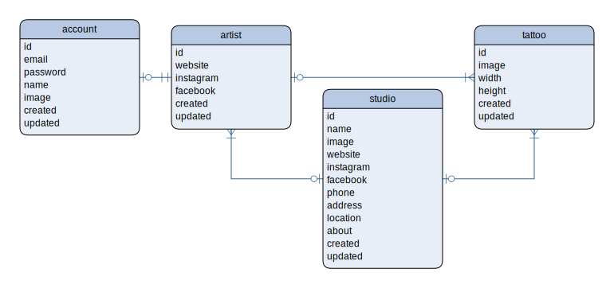

# @tattoo/server

Tattoo - Server

## Variables de entorno

Servidor Web:
  - SERVER_HOST: IP o nemónico del servidor web.
  - SERVER_PORT: Puerto del servidor web.

Base de datos:
  - DATABASE_HOST: IP o nemónico de la base de datos.
  - DATABASE_PORT: Puerto de la base de datos.
  - DATABASE_USER: Usuario de la base de datos.
  - DATABASE_PASSWORD: Contraseña de la base de datos.
  - DATABASE_NAME: Nombre de la base de datos.

## Base de datos

